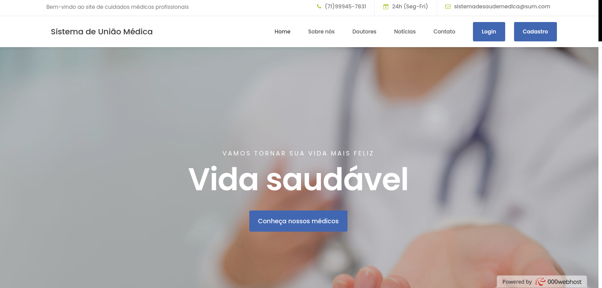
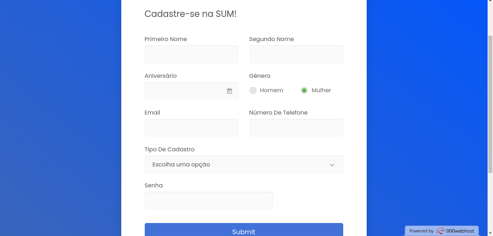

<h3 align="center"> 🏥 <b>Sistema de União Médica</b> ⚕️</h3>

  

##  📑 <b>Detalhes do projeto</b>
#

- Este projeto foi um trabalho desenvolvido pela equipe Ômega no projeto de conclusão do curso "Desenvolvimento de sistema" proposto pelo SENAC.

- Fomos excitados a criar um projeto com uma ideia que pudesse ser útil para a sociedade.

- Não foi posto uma limitação sobre pegar partes de outros projetos, até projetos de terceiros durante o desenvolvimento, então usamos códigos prontos durante a criação do projeto em algumas etapas.

  

## 💻 <b>Index do projeto</b>

 

</td>

 

A index foi um exemplo de código usado de terceiros em sites que os disponibilizavam, evitamos modificar os sistemas já prontos para não o quebrar. Entretanto, foi preciso modificarmos algumas partes do HTML e CSS para adaptarmos as nossas necessidades.

 

 
 

  

## 📥 <b>Cadastro & Login</b> 📤

<td></td><td></td>

 

 Usamos, novamente, um layout pronto encontrado devido à falta de tempo e demanda de conteúdo. Mas, desta vez, interagimos mais com o html e css, para a modificação de informações que estavam incompletas. E, para dar funcionalidade ao projeto, implementamos o PHP do zero. Para criar uma interação client side com serve side.

  

 
 

  

##  🌐 <b>Menu do Usuário e do Adm</b>

A partir desta área, os códigos foram autorais e desenvolvidos pela nossa equipe durante o tempo de desenvolvimento do programa. Utilizamos apenas HTML, CSS e PHP na construção do programa.
 

  

 

<dl>
  <dt><b><a href="imagensreadme/menu/blog.png">Blog</a></b></dt>
  <dd> O “blog” consiste em alguns post de saúde de fontes confiáveis serem disponibilizados para o usuário desfrutar de uma leitura sobre seu interesse.</dd>

   

  <dt><a href="imagensreadme/menu/doutores.png"><b>Marcar consulta</b></a></dt>
  <dd>Aqui o usuário encontra-se com algumas opções de profissionais da área de saúde, podendo escolher aquele que mais se encaixa em suas necessidades. </dd>
   
  <dd>Tendo escolhido um profissional, o usuário se depara com uma <a href="imagensreadme/menu/marcarconsulta.png">ficha</a> para ser preenchida com informações básicas para a marcação da consulta e é levado para uma área de confirmação com um aviso de sucesso.A informação é salva em um banco de dados.</dd>
</dl>